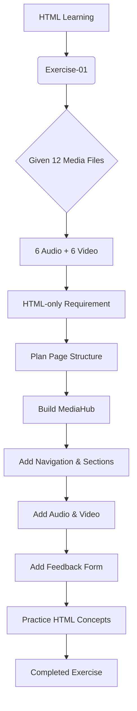
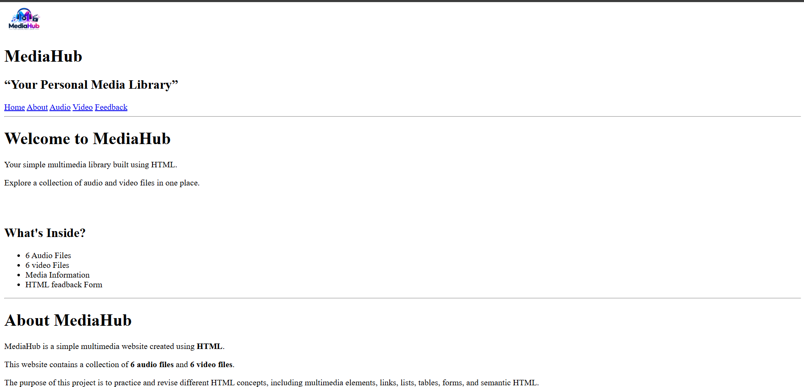
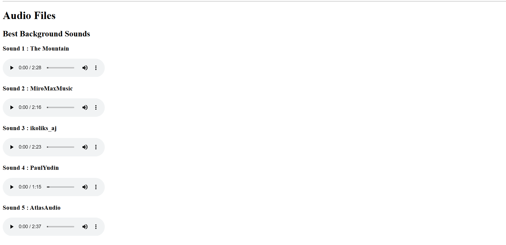
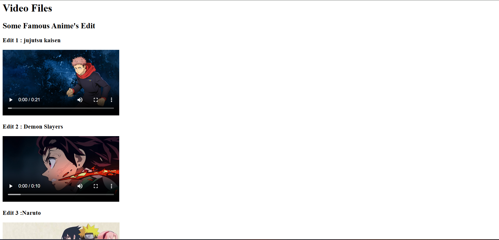
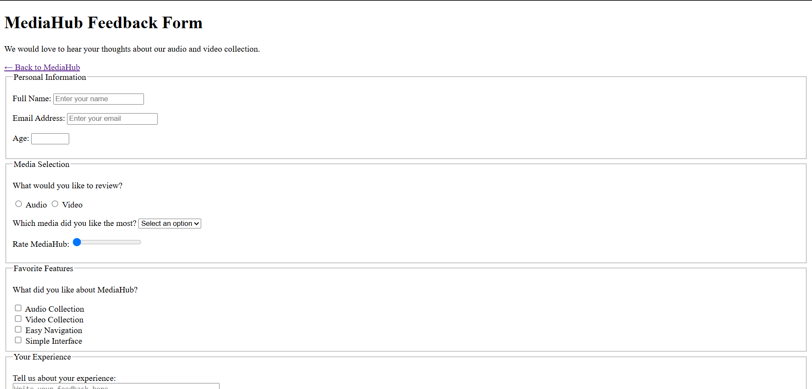
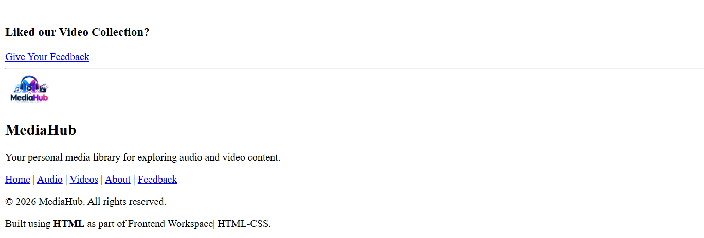

<div align="center">
  

  # MediaHub
  

  <p><em>Your Personal Media Library</em></p>


  
  
  
  

  <p><em>Exercise-01 — MediaHub — a hands-on HTML practice project</em></p>
</div>

---

**About Project**

MediaHub is a simple multimedia website built as the solution to Exercise-01 in the `Frontend-Workspace`. It was created to practice HTML fundamentals by presenting a small library of media files (6 audio + 6 video) using HTML only. The project includes a home/landing section, an about section, native audio and video collections, and a feedback form.

Key contents:
- 6 audio files (assets/Audio/1.mp3 … 6.mp3)
- 6 video files (assets/Video/1.mp4 … 6.mp4)
- Navigation and internal links
- Feedback form (form.html) with a range of inputs and validation attributes

---

**Original Exercise**

```
You are given 12 files; 6 audio and 6 video.
Design a website using HTML only which shows these 12 files.

1.mp3, 2.mp3 .... 6.mp3
1.mp4, 2.mp4 .... 6.mp4
```

Exercise → HTML-only requirement → Practice HTML concepts → Build MediaHub

---

**Features**

- Home / Landing section with a short description
- About section describing purpose and contents
- Audio collection: 6 native HTML `<audio>` elements with `controls`
- Video collection: 6 native HTML `<video>` elements with `controls` and `poster` attributes
- Internal navigation (anchor links) and page-to-page link to `form.html`
- Feedback page (`form.html`) containing a full HTML form:
	- Personal information fields (`text`, `email`, `number`)
	- Media selection using `radio` buttons
	- Favorite media `select` dropdown
	- Rating `range` input
	- Favorite features `checkbox` inputs
	- Experience `textarea`
	- Recommendation `select`
	- Date input and confirmation `checkbox`
	- Submit and Reset buttons (client-side HTML form behavior only)

---

**Concepts Used**

The following list describes the HTML concepts used in MediaHub — where they appear and why.

### HTML Document Structure
- `<!DOCTYPE html>` → in `index.html` and `form.html` → declares HTML5 document type
- `<html>`, `<head>`, `<meta>`, `<title>`, `<body>` → standard document scaffolding

### Semantic HTML
- `<header>` → top branding/navigation (logo, title)
- `<nav>` → primary navigation links (internal and to `form.html`)
- `<main>` → main content wrapper for sections
- `<section>` → `#home`, `#about`, `#audio`, `#video` used to group content
- `<footer>` → site footer and secondary navigation

### Text & Content
- Headings: `<h1>`, `<h2>`, `<h3>` → hierarchical page structure
- Paragraphs: `<p>` → descriptive text
- Inline formatting: `<strong>`, `<q>` → emphasis and quotations

### Links & Navigation
- `<a href="...">` → internal anchors (e.g. `#about`) and page link to `form.html`
- Internal section links using `id` attributes to enable quick navigation

### Lists
- `<ul>` / `<li>` → listing features and content

### Images
- `` → brand image in header and footer
- External `poster` URLs used on `<video>` elements for preview images

### Multimedia
- `<audio src="assets/Audio/X.mp3" controls>` → native audio playback controls (index.html)
- `<video src="assets/Video/X.mp4" controls poster="..." height="200">` → native video playback controls (index.html)

### Layout / Grouping
- `<div>`, `<hr>`, `<br>` → simple grouping and visual separation (HTML-only layout)

### Forms
- `<form>` → feedback form (form.html) that demonstrates many form elements
- `<fieldset>`, `<legend>` → logical grouping of related inputs
- `<label>` → accessible labels tied to controls via `for` and `id`
- Inputs: `<input>`, `<select>`, `<option>`, `<textarea>`, `<button>`

### Input Types & Attributes
- `type="text"`, `email`, `number`, `radio`, `range`, `checkbox`, `date`
- Attributes: `id`, `name`, `value`, `placeholder`, `required`, `min`, `max`, `rows`, `cols`

For each concept: where it is used → why it is used. These choices emphasize semantic structure, accessibility, and native browser behavior while practicing HTML fundamentals.

---

**Project Flow**



---

**Project Architecture**

```
MediaHub
│
├── index.html        # Landing, About, Audio, Video, Footer
├── form.html         # Feedback form with fields and validation attributes
└── assets/
		├── Audio/        # 1.mp3 … 6.mp3
		├── Video/        # 1.mp4 … 6.mp4
		├── Screenshots/  # example previews used in this README
		└── logo.png      # project logo used in header/footer
```

---

**Website Preview**

<div align="center">
	
	<p></p>
	 
	
	<p></p>
	
	<p></p>
	
</div>

---

**Project Directory**

```
Exercise-01/
├── assets/
│   ├── Audio/ (6 .mp3 files)
│   ├── Screenshots/ (project previews)
│   ├── Video/ (6 .mp4 files)
│   └── logo.png
├── form.html
├── index.html
└── README.md
```

Each file is HTML-only; `index.html` hosts the media sections and `form.html` contains the feedback form.

---

**Learning Outcomes**

- Improved understanding of HTML document structure and semantics
- Embedding and configuring native multimedia elements (`<audio>`, `<video>`)
- Building multi-section pages with internal navigation using anchor links
- Creating structured forms with a variety of input types and basic validation
- Working with relative file paths for media and images
- Grouping related controls with `<fieldset>` and associating `<label>`s for accessibility

---

**📝 Beginner Notes**

This project was created while learning HTML. The design is intentionally plain — CSS and JavaScript were not used because the exercise required an HTML-only solution. The minimal presentation keeps the focus on structure, semantics, multimedia, navigation, and form controls.

**Learning-first approach:** The project intentionally focuses on structure and functionality through HTML rather than visual styling.

---

**Future Improvements (Ideas)**

- Add CSS for responsive and modern styling (optional enhancement)
- Improve accessibility details (ARIA attributes, keyboard focus order)
- Add JavaScript-only enhancements for form validation or media filtering (kept separate from the HTML-only exercise)
- Add search or filtering for media items and pagination for larger libraries

---

**Tech / Scope**

| Technology | Used |
|---|---:|
| HTML5 | ✅ (Core structure and functionality)
| CSS | ❌ (Intentionally not used — HTML-only exercise)
| JavaScript | ❌ (Not used)
| Backend / Database | ❌ (No server-side functionality)

---

**Project Tracking**

This project is part of my `Frontend-Workspace` GitHub repository and is tracked as part of my ongoing frontend development learning journey. I use the GitHub Project named **Frontend-workspace Development** to organize progress, milestones, and daily updates for learning projects.

---

**Author**

This MediaHub exercise is part of my frontend learning journey. Building this small multimedia site helped me apply HTML concepts practically — I am adding projects step-by-step to strengthen my fundamentals.

---

<div align="center">
	<strong>If you found this project helpful:</strong>

	- ⭐ Star the repository
	- 🍴 Fork the repository
	- 💡 Share suggestions
	- 👀 Follow the learning journey

	<p>More frontend learning projects will be added over time.</p>

	<h3>Thank you! ❤️</h3>
</div>

