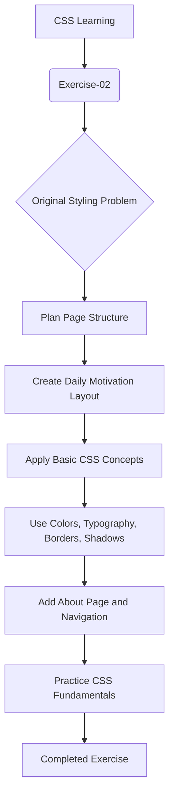

<div align="center">
  <h1>Daily Motivation</h1>
  

  <p><em>A simple daily inspiration page built while practicing CSS fundamentals</em></p>

  
  
  
  

  <p><em>Exercise-02 — Daily Motivation — a frontend learning project focused on basic CSS styling</em></p>
</div>

---

## About Project

Daily Motivation is a simple motivational landing page created as part of my `Frontend-Workspace` learning journey. This project belongs to Exercise-02 and was built to practice and revise basic HTML structure alongside CSS styling fundamentals.

The website is intentionally small and creative rather than production-focused. It presents a simple motivational message with headings, quote blocks, and styled text sections. The goal is to practice design decisions such as colors, borders, shadows, typography, spacing, and hover states while keeping the project easy to understand and beginner-friendly.

From `about.html`, the project is described as a website created during an HTML and CSS learning journey. The emphasis is not on building a fully functional platform, but on applying the CSS concepts I am currently learning in a practical mini-project.

---

## Original Exercise

The original assignment is reflected directly in the HTML comments at the top of `index.html`:

```text
Write html and css code to style a paragraph inside a div which contains 5 other paragraphs.
The first paragraph must have background color yellow and different text color.
The other paragraphs must have background color blue and text color different from 1st paragraph.
```

This project follows the same learning path:

```text
Original Exercise → CSS Practice → Daily Motivation Implementation
```

The end result is a styled motivational page that turns a simple styling exercise into a small themed website.

---

## Features

The website includes the following actual features:

- Home page section with a hero headline and intro message
- About page for project context and learning goals
- Navigation links between `index.html` and `about.html`
- Motivational quote/“thoughts” section with multiple styled paragraphs
- Styled headings, text blocks, and decorative underlines
- Background colors, gradients, borders, and shadows
- Hover effects on navigation and content blocks
- Footer with copyright text
- Simple two-page structure focused on practicing CSS visuals

This is a learning-first website, not a complex motivational product or app.

---

## Concepts Used

The CSS concepts used in this project are the main learning focus of Exercise-02. Each item below ties to actual code in `style.css` and `about.html`.

### CSS Basics

- External CSS → `style.css` is linked in both pages using `<link rel="stylesheet" href="style.css">`
- Internal CSS → `about.html` includes a `<style>` block for page-specific styling
- Universal selector → `* { margin: 0; padding: 0; }` in `style.css`
- Class selectors → `.hero`, `.container`, `.note`, `.sub-text`, `.ending-text`, `.selected`
- Element selectors → `header`, `nav a`, `footer`, `main`, `h1`, `p`

These selectors are used to keep the page structured and to style repeated elements consistently.

### Colors & Backgrounds

- Hex colors → used for various headings and accents such as `#FFF8E7`, `#0e1e9899`, `#04082854`
- RGB/RGBA → used across the project, for example `rgb(124, 146, 170)`, `rgb(36, 69, 90)`, and `rgb(111, 24, 24)`
- Linear gradients → used in `header`, `footer`, `main`, and decorative blocks:
  - `background: linear-gradient(to bottom right, rgb(...), rgb(...));`
  - `background: linear-gradient(to bottom, rgb(...), rgb(...));`
- Background-color on quote blocks → `.container :nth-child(2)` uses a yellow-green block style to create contrast from the rest of the cards

These choices help create the emotional and visual character of the motivational theme without using advanced design systems.

### Typography

- `font-family` → used extensively with `'Montserrat'`, `'Dancing Script'`, `'Roboto Condensed'`, and fallback fonts
- Google Fonts → imported in both `style.css` and `about.html` via `@import url('https://fonts.googleapis.com/css2?...')`
- `font-size` → applied to headings, hero text, paragraphs, and note sections
- `font-weight` → used to emphasize headings and text blocks
- `font-style` → italic text is used in the hero and quote sections
- `letter-spacing` → used in headings and decorative text to create a more styled look
- `line-height` → used in paragraph styling for readability and visual spacing

These properties are central to the project because the exercise is mainly about practicing visual text design.

### Text Styling

- `text-align` → used in `header`, `main`, and `.container` to center the content
- `text-transform` → applied to headings and nav links (`uppercase`, `capitalize`)
- `text-decoration` → used for underlines and decorative text emphasis
- `text-underline-offset` → used with underline styling for better spacing
- `text-shadow` → used in `header h1` and `nav a` to add depth to text

These text properties are used to create the “motivational” visual tone and to make the simple page feel more intentional and styled.

### Spacing & Box Styling

- `margin` → used throughout sections to build spacing between elements
- `padding` → used inside containers, blocks, and text sections
- `height` → applied to quote boxes in `.container p`
- `border` → used on `.container` and `.note`
- `border-radius` → used on the motivational block container
- `box-shadow` → used for section depth and hover effects
- `inset` shadows → used inside `.container p` and `.container :nth-child(2)` for inner depth

These properties are a core part of the exercise as they teach how space, borders, and depth affect page design.

### Selectors & Interaction

- `a:hover` → adds underline and shadow on navigation links
- `.container p:hover` → changes the appearance of quote boxes on hover
- `.note:hover` → applies stronger shadow and boldness
- `:nth-child()` → used in `.container :nth-child(2)` to target a specific quote block with a different background and color
- Class selectors and nested selectors → used across the page to create consistent styling patterns

This section shows how basic CSS interactions are used in a simple learning project without relying on advanced libraries or layouts.

---

## Project Flow



---

## Website Preview / Demo

<div align="center">

  <video src="assets/DAILY-MOTIVATION-website%20--Demo.mp4" controls width="700">
    Your browser does not support the video tag.
  </video>

  <p><em>Daily Motivation — Project Demo</em></p>

</div>

This website demo video is in the `assets` folder:

```text
assets/DAILY-MOTIVATION-website --Demo.mp4
```

The available preview is a local demo video rather than a hosted live website link. Because GitHub README embedding is not always reliable for local video files, the project is documented with the file path and the project purpose rather than a broken external link.

> The video is the primary visual preview for this exercise and represents the actual project demo asset in the folder.

---

## Project Directory

The actual folder structure for this project is:

```text
Exercise-02/
├── assets/
│   └── DAILY-MOTIVATION-website --Demo.mp4
├── about.html
├── index.html
├── style.css
├── README.md

```

This reflects the real files present in this exercise folder.

---

## Learning Outcomes

Through this project, I practiced and reinforced several beginner CSS and HTML skills:

- Applying CSS to an existing HTML structure
- Using external CSS and internal CSS in different situations
- Writing and understanding basic selectors
- Styling headings, paragraphs, and navigation text
- Working with colors, gradients, and contrasting palettes
- Using typography and font imports for presentation
- Improving text styling with transforms, decorations, spacing, and shadows
- Creating visual separation with margins, padding, borders, and box styling
- Building simple hover interactions and decorative emphasis
- Understanding how basic CSS influences layout and design without advanced frameworks

---

## Beginner Notes / Learning Scope

This project was created as a learning-first exercise and is intentionally simple.

- The website focuses on basic CSS styling concepts
- The design is intentionally limited to the concepts currently being practiced
- Advanced CSS layout techniques such as Flexbox and Grid are outside the scope of this exercise
- Filters, advanced animations, and other advanced techniques are intentionally not part of the current project unless they are actually present in the code
- The purpose is to strengthen fundamentals before moving into more advanced design topics in later exercises

This keeps the project honest: it is not meant to be a polished product, but a practical practice site that demonstrates early CSS learning.

---

## Future Improvements

These ideas represent future learning topics rather than missing project requirements:

- Flexbox for better alignment and layout control
- CSS Grid for more structured page layouts
- Responsive design for different screen sizes
- CSS transitions and animations for smoother interactivity
- More advanced selectors and pseudo-class styling
- Additional design exercises to expand visual variety and layout confidence

These are natural next steps in the learning journey, not fixes for an incomplete project.

---

## Tech / Scope

| Technology | Used |
|---|---:|
| HTML5 | ✅ |
| CSS3 | ✅ |
| JavaScript | ❌ |
| Backend / Database | ❌ |

CSS is the primary focus of this exercise, and the project is intentionally built as a beginner practice website.

---

## Project Tracking

This project is part of my `Frontend-Workspace` GitHub repository and represents my ongoing frontend learning journey. It is one step in a larger series of practice exercises focused on building fundamentals in HTML and CSS.

The project is tracked as part of my personal learning progress, not as a production system or commercial website.

---

## Author

This Daily Motivation project is part of my frontend learning journey. It helped me practice HTML structure, apply CSS styling fundamentals, and build a small themed page using the concepts I was learning at the time.

---

<div align="center">
  <strong>Exercise-02 — Daily Motivation</strong>
  <br>
  <p>Simple, creative, and focused on CSS fundamentals.</p>
  <h3>Keep learning. Keep building. 🚀</h3>
</div>
