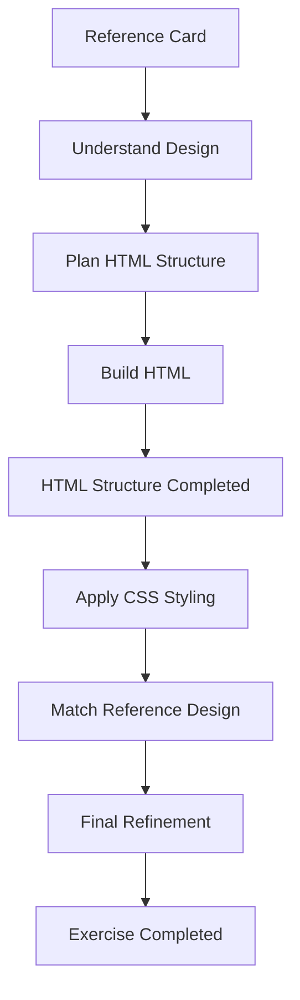

<div align="center">

# 🃏 Card Copy

### *Recreating a Reference Card with HTML & CSS*


**Exercise-03 • Frontend-Workspace**

*Building the structure first, styling next — one frontend exercise at a time.*

</div>

---

## 📌 About Project

**Card Copy** is **Exercise-03** of my `Frontend-Workspace` learning journey.

The goal of this exercise is to recreate a given/reference card design using **HTML and CSS**. The exercise focuses on understanding how a visual design can be broken down into individual HTML elements and then styled to match the original design.

At the current stage, the **HTML structure has been created** and the basic content/elements of the card are in place.

The **CSS styling is still remaining**, so the project is currently **Work in Progress**.

> 🚧 **Current Status:** HTML structure completed → CSS styling pending

This exercise is intentionally being developed step-by-step so that the structure and styling can be understood separately.

---

## 🎯 Original Exercise

The task is to **copy/recreate a given card design** using HTML and CSS.

The exercise can be understood as:

```text
Reference Card
      ↓
Understand the Structure
      ↓
Create HTML Structure
      ↓
Apply CSS Styling
      ↓
Match the Reference Design
```

The current implementation has reached the **HTML structure stage**.

---

## ✨ Current Progress

| Part                        | Status      |
| --------------------------- | ----------- |
| Understand Reference Design | ✅ Completed |
| Plan HTML Structure         | ✅ Completed |
| Create HTML Elements        | ✅ Completed |
| Add Card Content            | ✅ Completed |
| CSS Styling                 | ⏳ Pending   |
| Match Reference Design      | ⏳ Pending   |
| Final Visual Refinement     | ⏳ Pending   |

### 🚧 Current Stage

The project is **not complete yet**.

The card has currently been created using HTML to establish its basic structure. The next stage is to use CSS for:

* Layout and positioning
* Colors
* Typography
* Spacing
* Borders
* Shadows
* Card dimensions
* Other visual properties required to match the reference

---

## 🧩 Concepts Practiced

### HTML Structure

The current stage primarily focuses on creating the structure of the card using HTML.

* Semantic HTML structure
* Headings and text elements
* Images/media elements where required
* Links/buttons where required
* Nested elements
* Organizing content into meaningful sections

### CSS — Next Stage

CSS is the **next major learning stage** of this exercise.

The styling phase will focus on applying fundamental CSS concepts to the existing HTML structure.

Some of the areas to be practiced include:

* Colors
* Backgrounds
* Typography
* Spacing
* Width and height
* Borders
* Border radius
* Shadows
* Positioning
* Hover styling where required

> **Note:** These CSS concepts are listed as the upcoming styling work and are not being claimed as completed in the current version.

---

## 🔄 Project Flow



---

## 🖥️ Website Preview

### Current Version

The current version represents the **HTML structure stage** of the exercise.

The final visual appearance will be updated after the CSS styling phase is completed.

> 🚧 **Preview Status:** Styling is currently in progress.

---

## 📂 Project Directory

```text
Exercise-03/
├── index.html
├── style.css
├── assets/
└── README.md
```

> The structure above represents the current project organization. Additional files may be added as the exercise progresses.

---

## 📚 Learning Outcomes

Through this exercise, I am practicing how to:

* Break down a reference UI into HTML elements
* Build a structured HTML layout
* Organize nested elements
* Separate structure from presentation
* Translate a visual design into code
* Apply CSS styling to an existing HTML structure
* Understand the relationship between HTML and CSS
* Improve attention to spacing, sizing, and visual details

The exercise is being completed progressively rather than trying to build the complete design at once.

---

## 📝 Beginner Learning Scope

This is a **frontend learning exercise**, not a production-level project.

The current goal is to strengthen my understanding of how a webpage/card is built from the ground up.

The implementation is intentionally divided into stages:

```text
HTML → Structure
CSS  → Styling
Final → Reference Matching
```

At the moment, the **HTML structure has been completed**, while the CSS styling and final visual refinement are still pending.

This approach helps me understand each part of the frontend development process instead of relying on pre-built components or frameworks.

---

## 🚀 Future Work

The next development stage will focus on completing the CSS implementation.

### Upcoming Tasks

* [ ] Add complete CSS styling
* [ ] Match the reference card's dimensions
* [ ] Apply colors and backgrounds
* [ ] Style typography
* [ ] Add proper spacing and alignment
* [ ] Add borders and border radius
* [ ] Add shadows where required
* [ ] Implement required hover effects
* [ ] Compare the final card with the reference
* [ ] Refine the design
* [ ] Mark the exercise as completed

---

## 🛠️ Tech / Scope

| Technology         | Status |
| ------------------ | :----: |
| HTML5              |    ✅   |
| CSS3               |    ⏳   |
| JavaScript         |    ❌   |
| Frameworks         |    ❌   |
| Backend / Database |    ❌   |

**Primary focus:** HTML structure + CSS styling practice.

---

## 📊 Project Tracking

This project is part of my **`Frontend-Workspace`** GitHub repository, where I am documenting my frontend learning journey through progressive exercises.

Each exercise focuses on practicing specific concepts and gradually increasing the complexity of the implementations.

**Exercise-03** currently represents the transition from building a basic HTML structure toward applying CSS to recreate a reference-based UI.

> 🚧 **Project Status: Work in Progress**

---

## 👩‍💻 Author

**Shambhavi Chaudhary**

B.Tech Information Technology Student
Learning • Building • Improving — one frontend exercise at a time.

---

<div align="center">

### 🚧 Exercise-03 is currently in progress.

**HTML structure is ready. CSS styling is next.**

*More improvements coming as the learning continues.*

</div>
