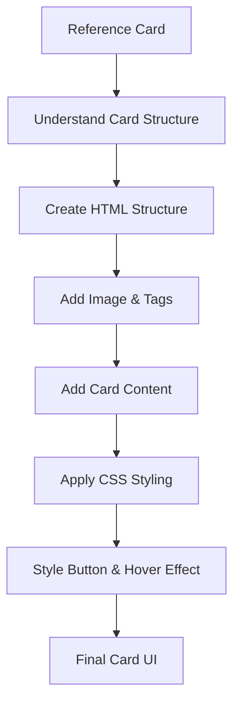
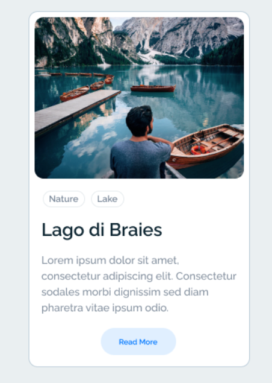
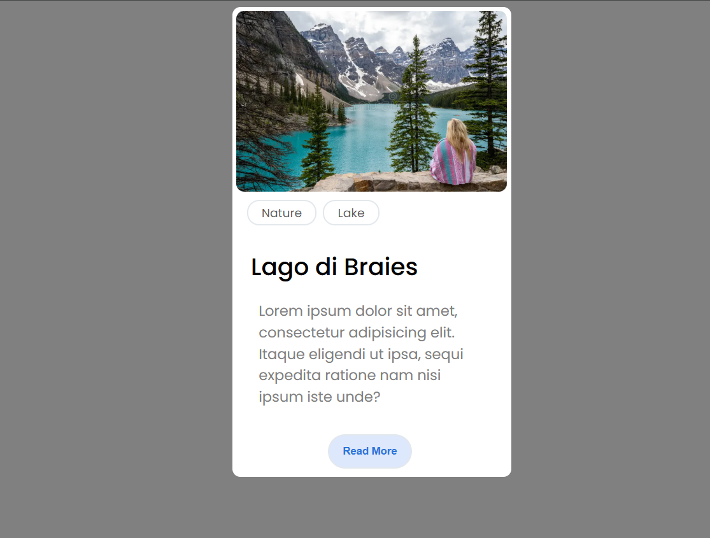

<div align="center">
  <h1>Card Designing</h1>
  

  <p><em>A simple card UI recreated using HTML and CSS while practicing frontend fundamentals</em></p>


  <p><em>Exercise-03 — Card Designing — an HTML and CSS practice project focused on recreating a card design</em></p>
</div>

---

## About Project

Card Designing is a simple card UI created as part of my `Frontend-Workspace` learning journey. This project belongs to Exercise-03 and was built to practice HTML structure alongside basic CSS styling.

The exercise focuses on recreating a given card design using HTML and CSS. The card contains a travel image, category tags, a heading, descriptive text, and a Read More button.

The project is intentionally small and beginner-friendly. The main goal is to understand how HTML elements can be structured into a UI component and then styled using CSS properties such as spacing, borders, typography, colors, and hover effects.

---

## Original Exercise

The original exercise asks me to use HTML and CSS to recreate a provided card design.

The problem statement is included directly in the HTML comments:

```text
assets is a folder which contains a card Image. Write html and css code to design this card. Use #html
```

The project follows a simple learning progression:

```text
Reference Design → Understand Card Structure → HTML Structure → CSS Styling → Final Card
```

The final result is a styled travel card inspired by the provided reference design.

---

## Features

The card includes the following actual features:

* Card-based UI layout
* Travel/nature image
* `Nature` and `Lake` category tags
* `Lago di Braies` heading
* Description text
* `Read More` button
* Rounded card corners
* Rounded image corners
* Pill-shaped tags
* Custom typography using Poppins
* Styled button with rounded corners
* Button hover effect
* Basic spacing using margin and padding
* Border and shadow styling

The `Read More` button is currently a visual UI element and does not perform navigation or any additional functionality.

---

## Concepts Used

The main learning focus of Exercise-03 is understanding how basic HTML structure and CSS styling work together to create a complete UI component.

### HTML Structure

* HTML5 document structure
* `<div>` elements for organizing card sections
* `` for displaying the card image
* `<ul>` and `<li>` for category tags
* `<h2>` for the card heading
* `<p>` for the description
* `<button>` for the Read More element
* `class` attributes for CSS styling
* `alt` attribute for the image

The card is divided into separate sections for the image, tags, content, and button to keep the HTML structure organized.

### CSS Basics

* External CSS stylesheet
* Universal selector
* Element selectors
* Class selectors
* `@import` for Google Fonts
* Background colors
* Text colors
* Basic component styling

### Box Model & Spacing

* `width`
* `height`
* `margin`
* `padding`
* `border`
* `border-radius`

These properties are used to control the size, spacing, shape, and visual boundaries of different card elements.

### Typography

* `font-family`
* `font-size`
* `font-weight`
* `line-height`
* Text color
* Google Fonts

The project uses the **Poppins** font to give the card a clean and modern appearance.

### Component Styling

* Card container styling
* Image sizing
* Rounded image corners
* Pill-shaped tags
* Heading styling
* Paragraph styling
* Button styling
* Background colors
* Border styling

### Interaction

* `:hover` pseudo-class
* `box-shadow`

The button uses a hover state to change its appearance and add visual depth.

---

## Project Flow



The flow represents the progression from understanding the reference design to building and styling the final card.

---

## Reference Design vs Final Output

### Reference Design

The original card design provided as the visual reference for the exercise.

<div align="center">



<p><em>Reference Design — Card UI used for recreation</em></p>

</div>

### Final Output

The card recreated using HTML and CSS.

<div align="center">



<p><em>Final Output — Lago di Braies Card</em></p>

</div>

The final implementation focuses on recreating the main visual structure of the reference while practicing fundamental HTML and CSS concepts.

---

## Project Directory

The actual folder structure for this project is:

```text
Exercise-03/
├── assets/
│   ├── final-card.png
│   └── reference-card.png
├── index.html
├── README.md
└── style.css
```

### File Overview

* `index.html` → Contains the HTML structure of the card.
* `style.css` → Contains the CSS styling and hover effect.
* `assets/reference-card.png` → Contains the reference card design.
* `assets/final-card.png` → Contains the final recreated card output.
* `README.md` → Documents the exercise, implementation, concepts, and learning outcomes.

---

## Learning Outcomes

Through this project, I practiced and reinforced several beginner HTML and CSS skills:

* Structuring a UI component using HTML
* Organizing content using `<div>` elements
* Working with images in HTML
* Using classes for CSS styling
* Understanding the CSS box model
* Managing margin and padding
* Working with borders and border radius
* Styling text and typography
* Using Google Fonts
* Creating pill-shaped category tags
* Styling buttons
* Adding basic hover effects
* Understanding how CSS properties combine to create a complete UI component
* Recreating a visual design using HTML and CSS

---

## Beginner Notes / Learning Scope

This project was created as a learning-first exercise and is intentionally simple.

* The project focuses on strengthening basic HTML and CSS fundamentals.
* The main goal is to recreate a single card UI from a visual reference.
* The implementation uses HTML and CSS without JavaScript.
* Advanced CSS layout systems such as Flexbox and Grid are outside the current implementation.
* Responsive design is not part of the current implementation.
* Advanced animations and transitions are not part of this exercise.
* The project focuses on understanding basic styling properties before moving toward more advanced layouts and interactions.

The purpose of this exercise is not to create a production-ready component, but to gain practical experience by turning a visual reference into a working HTML and CSS implementation.

---

## Future Improvements

These are possible future learning directions rather than requirements missing from the current exercise:

* Use Flexbox for better card alignment and positioning
* Make the card responsive for different screen sizes
* Add CSS transitions for smoother hover interactions
* Create more interactive hover states
* Build multiple cards using the same design
* Create a responsive card layout
* Improve semantic HTML structure
* Recreate the card component using React in later frontend exercises

These improvements can be explored as I progress toward more advanced frontend development concepts.

---

## Tech / Scope

| Technology         | Used |
| ------------------ | ---: |
| HTML5              |    ✅ |
| CSS3               |    ✅ |
| JavaScript         |    ❌ |
| Backend / Database |    ❌ |

HTML and CSS are the only technologies required for this exercise. The project is intentionally kept within the scope of basic frontend practice.

---

## Project Tracking

This project is part of my `Frontend-Workspace` GitHub repository and represents **Exercise-03** in my HTML and CSS learning journey.

The exercise builds on fundamental frontend concepts by moving from basic styling practice toward recreating a complete UI component from a visual reference.

It is tracked as a learning project focused on strengthening frontend fundamentals rather than building a production system.

---

## Author

This Card Designing  project is part of my frontend learning journey. It helped me practice HTML structure, CSS styling, spacing, typography, component styling, and basic interaction by recreating a card from a visual reference.

---

<div align="center">
  <strong>Exercise-03 — Card Designing</strong>
  <br>
  <p>Simple, practical, and focused on HTML & CSS fundamentals.</p>
  <h3>Keep learning. Keep building. 🚀</h3>
</div>
