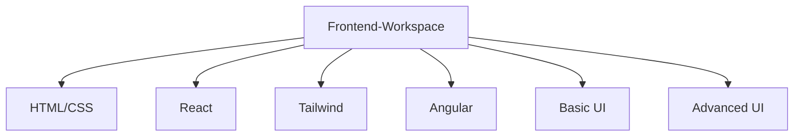
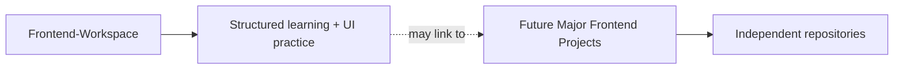
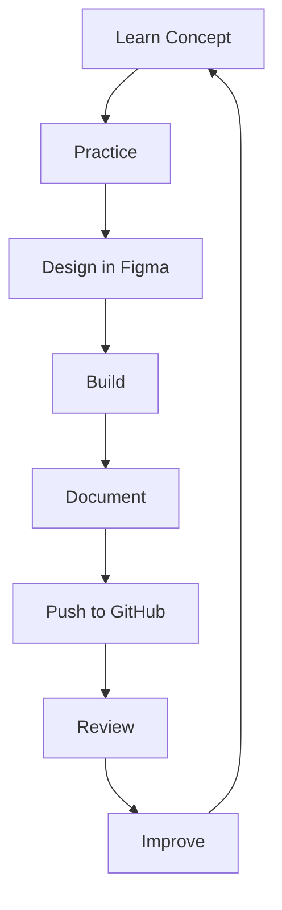
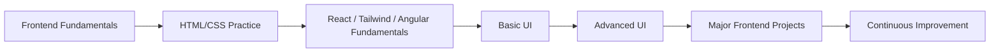
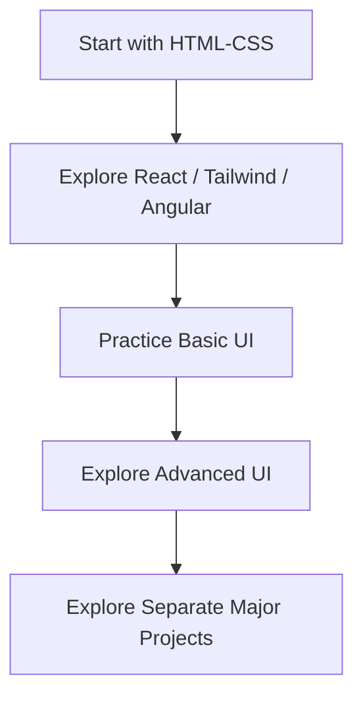

<p align="center">
  
</p>

<div align="center">
  
</div>

<div align="center">
  
  
  
  
  
  
  
  
  
  
</div>

<p align="center"><em>A structured workspace documenting my complete frontend development journey.</em></p>

---

## 1. Hero

`Frontend-Workspace` is my personal frontend development learning journal and structured workspace. It is where my fundamentals, daily practice, UI exploration, design-to-code thinking, and documentation come together in one place.

This repository is not just a folder of files. It is a record of:

- what I learned
- what I practiced
- what I designed
- what I built
- how I documented it
- how I improved over time

It reflects the path from foundational HTML and CSS work to UI implementation, understanding patterns, and moving toward more advanced frontend practices.

> [!TIP]
> If you enjoy following a developer's learning journey, this repository is a good place to explore how a frontend foundation grows through practice, documentation, and iteration.

---

## 2. Welcome

Welcome to my frontend workspace.

This repository represents my learning journey in frontend development and how I try to organize that knowledge in a way that is understandable, useful, and honest. It is intentionally structured so that someone can see how my understanding develops from basics toward UI development and more advanced frontend work.

This is not a polished corporate-style portfolio page. It is a personal and practical workspace built around real growth: study, practice, implementation, design, and documentation.

I want this repository to feel like a visible trail of progress, not just a collection of code.

---

## 3. Before You Explore

This repository is part of a larger personal learning ecosystem, and it is helpful to understand how the pieces fit together.

My JavaScript learning journey is maintained separately in:

- [Javascript-Workspace](ADD-JAVASCRIPT-WORKSPACE-LINK-HERE)

Website recreation and redesign practice is maintained separately in:

- [Dumy-Websites](ADD-DUMY-WEBSITES-LINK-HERE)

These repositories are connected to my overall development journey, but they are intentionally kept separate so that each area of learning has a clear purpose and structure.

---

## 4. Why This Repository Exists

`Frontend-Workspace` exists to document my frontend development journey from fundamentals toward more advanced UI work.

It captures:

- learning fundamentals
- practicing technologies
- building small exercises
- designing interfaces
- implementing designs
- documenting my progress
- improving through iteration
- maintaining GitHub discipline

This repository is meant to be a learning archive and a development workspace, not a catch-all for every project I create.

A major distinction is important:

This repository is not intended to contain every frontend project I make. Larger or more complete frontend projects will eventually have their own independent GitHub repositories.

That keeps the focus here on structured learning, UI practice, and visible progression.

---

## 5. My Goal

My frontend goal is simple but meaningful:

**Learn → Practice → Design → Build → Document → Review → Improve → Repeat**

Frontend development is best learned by doing. Concepts become stronger when they are translated into interfaces, components, layouts, and real implementation work. I want to learn in a way that is active, visible, and honest.

Each folder in this repository represents a different stage of that journey. Some areas focus on fundamentals, others on implementation, and others on UI design and more advanced frontend thinking.

---

## 6. Workspace Architecture

This section shows the structure of the repository and how the different learning areas are organized.

```text
Frontend-Workspace/
│
├── HTML-CSS/
├── React/
├── Tailwind/
├── Angular/
│
├── Basic-UI/
└── Advanced-UI/
```



### Purpose of each area

- `HTML-CSS`: foundational markup, styling, layout, and early frontend exercises
- `React`: component-based learning and practical React exploration
- `Tailwind`: styling workflow, utility-first CSS learning, and UI experimentation
- `Angular`: early Angular fundamentals and framework-based practice
- `Basic-UI`: full webpage and interface practice based on design-to-code workflow
- `Advanced-UI`: more polished UI implementations using richer frontend combinations

This structure helps separate technology learning from interface practice, while still keeping the journey connected.

---

### HTML-CSS

This folder contains the fundamental HTML and CSS exercises I created while learning these technologies.

The work here is intentionally early-stage and focused. It includes small exercises such as:

- HTML forms
- background and color changes
- paragraph styling experiments
- card layouts
- simple UI patterns
- small front-end structure exercises

I created approximately 8 small projects/exercises in this area, with the difficulty increasing as I became more comfortable with layout and styling.

These are fundamental exercises, not major application builds. They document the early stage of my frontend learning and show how I started building confidence with HTML and CSS before moving into more complex UI work.

> Website recreation and redesign exercises are not stored here if they belong in my separate `Dumy-Websites` repository.

### React

This folder contains my React learning and practice work.

The goal here is not to build a large production app, but to document the fundamentals of React in a practical, approachable way. These are smaller learning implementations designed to help me understand:

- component-based thinking
- props and state
- UI composition
- React structure
- basic implementation patterns

It represents part of my progression while learning React and building familiarity with how interfaces are organized in a component-driven workflow.

### Tailwind

This folder contains my early Tailwind CSS learning and practice work.

It represents the stage where I started exploring utility-first styling and quickly seeing how design and implementation can become more efficient. It is a practical learning area where I build familiarity with layout, spacing, responsiveness, and visual consistency using Tailwind.

This is an important step before moving into more advanced UI implementations.

### Angular

This folder contains my foundational Angular learning and practice work.

Like the other technology-focused folders, it documents the early stage of my Angular journey rather than major application work. It helps me understand framework structure, component thinking, and how Angular fits into my broader frontend learning path.

This folder represents a foundational stage before I begin using Angular more heavily in advanced UI development.

### Basic UI

This folder is different from the technology-learning folders. It is focused on complete UI and webpage practice projects.

The workflow for this area is:

```text
Figma Design
      ↓
HTML + CSS
      ↓
Webpage Implementation
      ↓
Documentation
      ↓
GitHub
```

The process is intentionally clear:

1. I first design the webpage in Figma.
2. I then implement the design using HTML and CSS.
3. The implemented webpage is stored in this folder.
4. The design is documented/shared wherever applicable.
5. The final work is pushed to GitHub for review and reflection.

These projects help me practice:

- layout structure
- spacing and alignment
- typography
- visual hierarchy
- composition
- responsive design
- component-like thinking
- translating a design into code
- HTML and CSS implementation

This folder is about design-to-code practice and building confidence in turning a visual concept into a successful webpage.

> These Basic UI projects use only HTML and CSS. They are not built with React, Angular, or Tailwind.

### Advanced UI

This folder represents the next level of my UI development journey.

It is focused on more advanced interface work than what appears in `Basic-UI`. The workflow is:

```text
Figma Design
      ↓
Advanced Frontend Implementation
      ↓
Documentation
      ↓
GitHub
```

The implementations here may use:

- React
- Angular
- Tailwind CSS

The purpose is to combine frontend technologies with design thinking and create more sophisticated interfaces and webpage experiences.

Figma designs are also documented/shared wherever applicable, and the final result is treated as a polished UI practice project rather than a casual exercise.

---

## 7. Separate JavaScript Workspace

JavaScript has its own dedicated repository, and that separation is intentional.

- `Javascript-Workspace` documents my JavaScript learning journey.
- It is a separate track from this repository.
- There is intentionally no JavaScript folder inside `Frontend-Workspace`.
- JavaScript still remains an important part of my frontend journey.
- The separation helps keep my learning organized and focused.

[Explore Javascript-Workspace →](ADD-JAVASCRIPT-WORKSPACE-LINK-HERE)

---

## 8. Separate Dumy-Websites Repository

`Dumy-Websites` is a separate repository where I store website recreation and redesign practice.

This includes UI recreation tasks and design-based webpage studies that are not part of `Frontend-Workspace`.

This separation keeps the following organized independently:

- fundamental frontend learning
- technology practice
- UI implementation work
- recreated websites and redesign studies

[Explore Dumy-Websites →](ADD-DUMY-WEBSITES-LINK-HERE)

---

## 9. Future Major Frontend Projects

At some point, I expect to build larger and more complete frontend projects. These may combine:

- HTML
- CSS
- JavaScript
- React
- Tailwind CSS
- Angular

However, these future projects will not live as folders inside `Frontend-Workspace` or `Javascript-Workspace`.

They will have their own independent GitHub repositories, because major frontend projects deserve their own dedicated structure, documentation, and recognition.

`Frontend-Workspace` may later point to those projects as part of my overall frontend portfolio and journey, but the projects themselves remain separate repositories.



[Future Major Frontend Projects →](ADD-LINK-HERE)

---

## 10. My Learning Workflow

My learning process is very practical, and I try to keep it consistent.



This workflow matters because frontend growth does not come from theory alone. It comes from repeated practice, thoughtful design, honest review, and continuous improvement.

The goal is to learn in a way that is visible and sustainable. Each step helps turn understanding into something stronger and more real.

---

## 11. Why I Started Tracking Late

I started documenting my frontend learning more intentionally because I wanted to become more aware of my own progress.

A lot of development work happens in small steps, and without documentation those steps can easily feel invisible. I wanted to create a clearer record of what I was learning, what I was practicing, and how my understanding changed over time.

This is not about perfection. It is about becoming more intentional:

- seeing progress over time
- revisiting old work with better perspective
- understanding what improved and what still needs work
- building stronger GitHub habits
- organizing my projects better
- presenting my frontend journey more clearly

Documentation helps me take my learning seriously and gives my work a sense of continuity.

---

## 12. Why This Repository Matters

This repository matters because it gives me a clear view of how my frontend skills have developed.

It allows me to see the journey from:

**fundamental exercises → technology practice → UI implementation → advanced UI development**

It also helps me build habits around:

- consistency
- documentation
- design
- development
- version control
- project presentation

This is not just a storage place. It is part of my professional development process and a visible record of how I grow as a frontend developer.

---

## 13. Repository Timeline

This repository represents a progression, not a single snapshot.



The important distinction is that major frontend projects are separate repositories rather than folders inside this workspace.

---

## 14. For Beginners

If you are learning frontend development, this repository can be useful as a practical example of how a learning journey can be structured.

Rather than jumping straight into large projects, the path here is more gradual:

- start with fundamentals
- build confidence with HTML and CSS
- explore React, Tailwind, and Angular
- practice UI work in a more design-driven way
- move toward more advanced implementation

This is a simple but effective way to see how frontend learning can become more organized and deliberate over time.

---

## 15. Contribution

This repository is primarily a personal workspace, but it is still open to useful suggestions.

If something is unclear, missing, or could be improved, I welcome:

- issues
- forks
- pull requests
- suggestions

Even small improvements to documentation, structure, examples, or clarity matter.

> [!IMPORTANT]
> Good documentation and thoughtful structure are part of the learning process. Small improvements can make a big difference in how a project is understood and used.

---

## 17. Explore My Other Workspaces

`Frontend-Workspace` is part of a larger learning ecosystem. It is not isolated from the rest of my development journey.

It connects to:

- [Javascript-Workspace](ADD-JAVASCRIPT-WORKSPACE-LINK-HERE)
- [Dumy-Websites](ADD-DUMY-WEBSITES-LINK-HERE)
- future frontend project repositories

This section acts as a navigation hub for the broader set of work I am building around frontend learning and UI practice.

---

## 18. Thank You

Thank you for exploring this repository.

This workspace represents my effort to stay consistent with learning, practice, design, development, documentation, and personal growth. It is not a finished product in the traditional sense, but it is a living record of where my frontend journey is headed and how I am building it step by step.

I appreciate your time and interest in seeing the process behind the work.

---

## Quick Snapshot

| Category | Status |
| --- | --- |
| Repository Type | Frontend Learning + UI Development Workspace |
| Primary Focus | Frontend Development |
| Technologies | HTML, CSS, React, Tailwind CSS, Angular |
| Design Tool | Figma |
| UI Workflow | Design → Development → Documentation |
| Journey | Fundamentals → Advanced UI |
| Goal | Consistent Frontend Growth |

---

<details>
<summary>Open to see the learning philosophy behind this workspace</summary>

This workspace is built around a few core ideas:

- learning should be visible
- practice should be consistent
- designs should become real interfaces
- documentation should be part of development
- improvement should happen continuously

These principles are what make the repository more than a collection of code. They turn it into a record of growth, reflection, and intentional learning.

</details>

---

## Learning Principles

| Principle | Meaning |
| --- | --- |
| Clarity | Learning should be understandable and easy to revisit. |
| Consistency | Small regular effort builds stronger frontend skills than occasional bursts. |
| Practice | Code and UI work matter more than passive reading alone. |
| Design | Good frontend work is not just functional; it is thoughtful and visually structured. |
| Documentation | A project is easier to understand when its process is recorded. |
| Iteration | Improvement comes from building, reviewing, and refining work repeatedly. |
| Growth | Every exercise and UI project is part of a larger development path. |

---

## How to Navigate This Repository



A practical way to navigate this repository is:

- beginners can start with `HTML-CSS`
- technology-specific learning can be explored next through `React`, `Tailwind`, and `Angular`
- UI-focused work can be explored through `Basic-UI`
- advanced implementation work can be explored through `Advanced-UI`
- larger projects can eventually be explored in their separate repositories

---

## Current Focus Areas

| Focus Area | Why It Matters |
| --- | --- |
| HTML/CSS Fundamentals | Strong foundation for frontend development. |
| React | Component-based UI development and repeatable patterns. |
| Tailwind CSS | Efficient styling and interface implementation. |
| Angular | Framework-based frontend development and structure. |
| UI Development | Turning design ideas into working interfaces. |
| Figma-to-Code | Connecting design thinking to actual frontend work. |
| Responsive Design | Building interfaces that adapt to different screens. |
| Documentation | Making knowledge visible and organized. |
| Git/GitHub | Maintaining a professional development workflow. |

---

## What This Repository Teaches Me Beyond Frontend

This repository is teaching me more than a set of frontend technologies.

It is helping me develop:

- design thinking
- visual hierarchy
- attention to detail
- project organization
- documentation discipline
- Git/GitHub workflow
- design-to-code thinking
- iteration and refinement
- professional presentation of work

Frontend development is not only about writing code. It is also about making decisions, structuring work, and presenting results clearly.

---

## A Final Reflection

Frontend development is not simply about learning HTML, CSS, JavaScript, or frameworks.

It is about:

- understanding how interfaces work
- learning how design and code relate
- turning ideas into real experiences
- practicing repeatedly
- learning from imperfect implementations
- documenting progress honestly
- improving over time

This repository is a visible record of that journey. It captures the process, not just the outcome, and that is what makes it valuable.

---

<p align="center">
  
</p>
